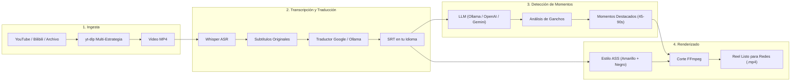

# AutoClip Multi-Language 🎬🤖

<div align="center">


### Generador Autónomo de Clips y Reels con Inteligencia Artificial para Redes Sociales

**Convierte videos largos de YouTube y Bilibili en clips virales de 45–90 segundos con traducción automática y subtítulos de alto contraste.**

[](https://python.org)
[](https://fastapi.tiangolo.com)
[](https://reactjs.org)
[](https://vitejs.dev)
[](https://celeryproject.org)
[](https://redis.io)
[](LICENSE)

**Idiomas / Languages / 语言**:  
[English](README.md) | [Español](README.es.md) | [中文](README.zh.md)

</div>

---

## 📖 Acerca de AutoClip Multi-Language

**AutoClip Multi-Language** es una versión extendida e internacionalizada del proyecto de código abierto [AutoClip](https://github.com/zhouxiaoka/autoclip) desarrollado por Zhou Xiaoka.

Esta edición transforma el sistema original en una **herramienta accesible globalmente**, diseñada especialmente para creadores de contenido que publican en **TikTok, Instagram Reels y YouTube Shorts**.

### 🌟 ¿Qué hace especial a esta versión?
- 🌐 **Interfaz y Backend 100% Internacionalizados**: Cero caracteres chinos residuales en modos Español e Inglés. Detección automática del idioma del navegador.
- 📱 **Clips Optimizados de 45–90 Segundos**: Pipeline calibrado para los algoritmos de retención de video vertical, evitando fragmentos excesivamente largos de 5 a 8 minutos.
- 🗣️ **Traducción Automática de Subtítulos**: Si procesas un video en inglés o chino con la interfaz en español, los subtítulos se traducen automáticamente al español mediante Google Translate con respaldo en **Ollama** offline.
- 🎨 **Subtítulos Quemados de Alta Visibilidad**: Graba automáticamente subtítulos en el MP4 con tipografía **amarilla brillante y contorno negro sólido**, garantizando lectura perfecta sobre cualquier escena.
- 🛡️ **Descargas Resilientes de YouTube**: Detección de cookies de sesión y emulación de clientes móviles en `yt-dlp` para evitar bloqueos por bots o límites HTTP 429.
- 🔒 **IA Local y Privada**: Compatibilidad total con [Ollama](https://ollama.ai) (`gemma4`, `qwen2.5`), permitiendo operar 100% en local sin costos de API y con privacidad absoluta.

---

## 🏗️ Arquitectura del Sistema



---

## ⚡ Inicio Rápido

### Requisitos Previos
- **Python 3.10+**
- **Node.js 18+** y npm
- **FFmpeg** (`brew install ffmpeg` / `sudo apt install ffmpeg`)
- **Redis** (`brew services start redis` / `sudo systemctl start redis`)

### 1. Clonar el Repositorio
```bash
git clone https://github.com/TU_USUARIO/autoclip-multilanguage.git
cd autoclip-multilanguage
```

### 2. Configurar Variables de Entorno
```bash
# Copiar plantilla limpia
cp .env.example .env
```

Para usar **IA 100% local y gratuita**, instala [Ollama](https://ollama.ai) y ejecuta:
```bash
ollama pull gemma4:latest
```
Y configura en `.env`:
```bash
LLM_PROVIDER=openai
OPENAI_BASE_URL=http://localhost:11434/v1
API_OPENAI_API_KEY=ollama
API_MODEL_NAME=gemma4:latest
```

### 3. Iniciar Servicios
En macOS / Linux:
```bash
./start_autoclip.sh
```

El script preparará el entorno virtual, instalará dependencias, creará la base de datos y levantará:
- **Panel Web**: [http://localhost:3001](http://localhost:3001)
- **Documentación API**: [http://localhost:8001/docs](http://localhost:8001/docs)

Para detener los servicios:
```bash
./stop_autoclip.sh
```

---

## 🐳 Despliegue con Docker

```bash
docker-compose up -d
```

---

## 📚 Documentación Completa

| Idioma | Directorio | Guías Principales |
| :--- | :--- | :--- |
| **Español** | [`docs/es/`](docs/es/) | [Arquitectura](docs/es/ARQUITECTURA.md) • [Guía de Inicio](docs/es/GUIA_INICIO.md) • [Configuración](docs/es/CONFIGURACION.md) • [Características](docs/es/CARACTERISTICAS.md) • [Cambios](docs/es/CAMBIOS_MULTILENGUAJE.md) |
| **English** | [`docs/en/`](docs/en/) | [Architecture](docs/en/ARCHITECTURE.md) • [Getting Started](docs/en/GETTING_STARTED.md) • [Configuration](docs/en/CONFIGURATION.md) • [Features](docs/en/FEATURES.md) • [Changelog](docs/en/CHANGELOG_MULTILANGUAGE.md) |
| **中文 (原版)** | [`docs/cn/`](docs/cn/) | [原架构与开发文档](docs/cn/DEVELOPER_GUIDE.md) • [系统架构](docs/cn/SYSTEM_ARCHITECTURE.md) |

---

## 🛠️ Proveedores de Modelos de Lenguaje (LLM) Compatibles

Todos los siguientes proveedores están totalmente integrados y son compatibles en AutoClip Multi-Language:

| Proveedor | Compatibilidad | Tipo de Ejecución | Clave de Configuración (.env) | Modelos Populares / Recomendados |
| :--- | :---: | :--- | :--- | :--- |
| **Ollama** | ✅ Soportado | 💻 Local / Offline (Gratis) | `OPENAI_BASE_URL=http://localhost:11434/v1` | `gemma4:latest`, `qwen2.5:latest` |
| **LM Studio** | ✅ Soportado | 💻 Local / Offline (Gratis) | `OPENAI_BASE_URL=http://localhost:1234/v1` | Cualquier modelo local GGUF |
| **OpenAI** | ✅ Soportado | ☁️ API en la Nube | `API_OPENAI_API_KEY=sk-...` | `gpt-4o-mini`, `gpt-4o` |
| **DeepSeek** | ✅ Soportado | ☁️ API en la Nube (Compatible OpenAI) | `OPENAI_BASE_URL=https://api.deepseek.com/v1` | `deepseek-chat`, `deepseek-reasoner` |
| **Google Gemini** | ✅ Soportado | ☁️ API en la Nube | `API_GEMINI_API_KEY=...` | `gemini-1.5-flash`, `gemini-1.5-pro` |
| **Alibaba DashScope** | ✅ Soportado | ☁️ API en la Nube | `API_DASHSCOPE_API_KEY=...` | `qwen-plus`, `qwen-turbo` |
| **SiliconFlow** | ✅ Soportado | ☁️ API en la Nube | `API_SILICONFLOW_API_KEY=...` | DeepSeek, Qwen, GLM |

---

## 📄 Licencia y Créditos

- **Proyecto Base**: [AutoClip](https://github.com/zhouxiaoka/autoclip) por **Zhou Xiaoka**.
- Licencia: [MIT License](LICENSE).
