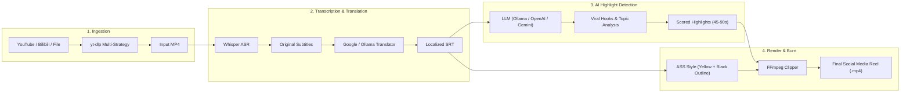

# AutoClip Multi-Language 🎬🤖

<div align="center">


### AI-Powered Autonomous Video Clipping & Reel Generator for Social Media

**Transform long-form YouTube & Bilibili videos into viral 45–90s clips with automatic subtitle translation and high-contrast styling.**

[](https://python.org)
[](https://fastapi.tiangolo.com)
[](https://reactjs.org)
[](https://vitejs.dev)
[](https://celeryproject.org)
[](https://redis.io)
[](LICENSE)

**Languages / Idiomas / 语言**:  
[English](README.md) | [Español](README.es.md) | [中文](README.zh.md)

</div>

---

## 📖 About AutoClip Multi-Language

**AutoClip Multi-Language** is an open-source, internationalized fork and enhancement of the original [AutoClip](https://github.com/zhouxiaoka/autoclip) system created by Zhou Xiaoka.

While the original application laid a solid foundation for video clipping in Chinese, this edition expands AutoClip into a **globally accessible, multi-lingual tool** tailored for content creators worldwide who produce content for **TikTok, Instagram Reels, and YouTube Shorts**.

### 🌟 What Makes This Version Different?
- 🌐 **100% Internationalized UI & Backend**: Zero residual Chinese characters in Spanish and English modes. Full automatic browser language detection.
- 📱 **Optimized 45–90s Short-Form Clips**: Pipeline specifically tuned for viral social media algorithms, avoiding overly long 5–8 minute cuts.
- 🗣️ **Cross-Lingual Subtitle Translation**: Automatically translates subtitles to your preferred language (e.g., English or Chinese speech to Spanish subtitles) using Google Translate with offline **Ollama** LLM fallback.
- 🎨 **High-Contrast Subtitle Burning**: Automatically burns subtitles into the video with social media styling: **bold yellow typography with solid black outline** for maximum legibility on mobile screens.
- 🛡️ **Anti-Bot YouTube Downloader**: Multi-strategy `yt-dlp` parsing leveraging browser cookies and mobile client emulation to prevent HTTP 429 and bot blocks.
- 🔒 **Privacy-First Local AI**: Full compatibility with local offline models via [Ollama](https://ollama.ai) (`gemma4`, `qwen2.5`) with zero API costs and total data privacy.

---

## 🏗️ System Architecture



---

## ⚡ Quick Start

### Prerequisites
- **Python 3.10+**
- **Node.js 18+** & npm
- **FFmpeg** (`brew install ffmpeg` / `sudo apt install ffmpeg`)
- **Redis** (`brew services start redis` / `sudo systemctl start redis`)

### 1. Clone the Repository
```bash
git clone https://github.com/betoalien/autoclip-multilanguage.git
cd autoclip-multilanguage
```

### 2. Initial Setup (Dependencies & Database)
Choose your preferred language or run the auto-detecting script:

| Language | Setup Command | Description |
| :--- | :--- | :--- |
| 🌐 **Auto-Detect** | `./setup.sh` | Automatically detects system language and runs the proper script |
| 🇬🇧 **English** | `./setup_en.sh` | Sets up venv, installs requirements, builds frontend in English |
| 🇪🇸 **Español** | `./setup_es.sh` | Configura el entorno virtual, instala dependencias y compila en Español |
| 🇨🇳 **中文** | `./setup_zh.sh` | 配置 Python 虚拟环境、安装前后端依赖并初始化数据库 |

The setup script automatically:
1. Creates the Python virtual environment (`venv`).
2. Installs Python dependencies (`requirements.txt`).
3. Generates `.env` from `.env.example` with local Ollama defaults.
4. Initializes the SQLite database schema (`data/autoclip.db`).
5. Installs frontend npm dependencies.

### 3. Configure AI Provider (.env)
Edit `.env` to select your preferred AI provider. For **100% free offline local AI**, install [Ollama](https://ollama.ai) and run:
```bash
ollama run gemma4:latest
# or: ollama run qwen2.5:latest
```
Your `.env` is already pre-configured for Ollama by default:
```bash
LLM_PROVIDER=openai
OPENAI_BASE_URL=http://localhost:11434/v1
API_OPENAI_API_KEY=ollama
API_MODEL_NAME=gemma4:latest
```

### 4. Launch Services
Start all services (Redis, Celery Worker, FastAPI Backend, Frontend Dashboard):

```bash
# English
./start_autoclip_en.sh

# Español
./start_autoclip_es.sh

# 中文
./start_autoclip_zh.sh

# Universal Auto-Detect
./start_autoclip.sh
```

Once started:
- **Web Dashboard**: [http://localhost:3001](http://localhost:3001)
- **FastAPI Documentation**: [http://localhost:8001/docs](http://localhost:8001/docs)
- **Health Check**: [http://localhost:8001/api/v1/health/](http://localhost:8001/api/v1/health/)

### 5. Service Management

| Action | English | Español | 中文 | Universal |
| :--- | :--- | :--- | :--- | :--- |
| **Check Status** | `./status_autoclip_en.sh` | `./status_autoclip_es.sh` | `./status_autoclip_zh.sh` | `./status_autoclip.sh` |
| **Stop Services** | `./stop_autoclip_en.sh` | `./stop_autoclip_es.sh` | `./stop_autoclip_zh.sh` | `./stop_autoclip.sh` |
| **Quick Start** | `./quick_start_en.sh` | `./quick_start_es.sh` | `./quick_start_zh.sh` | `./quick_start.sh` |

---

## 🐳 Docker Deployment

Run the complete stack with a single command:
```bash
docker-compose up -d
```

---

## 📚 Documentation Directory

Comprehensive documentation is available in multiple languages:

| Language | Path | Key Guides |
| :--- | :--- | :--- |
| **English** | [`docs/en/`](docs/en/) | [Architecture](docs/en/ARCHITECTURE.md) • [Getting Started](docs/en/GETTING_STARTED.md) • [Configuration](docs/en/CONFIGURATION.md) • [Features](docs/en/FEATURES.md) • [Changelog](docs/en/CHANGELOG_MULTILANGUAGE.md) |
| **Español** | [`docs/es/`](docs/es/) | [Arquitectura](docs/es/ARQUITECTURA.md) • [Guía de Inicio](docs/es/GUIA_INICIO.md) • [Configuración](docs/es/CONFIGURACION.md) • [Características](docs/es/CARACTERISTICAS.md) • [Cambios](docs/es/CAMBIOS_MULTILENGUAJE.md) |
| **中文 (原版)** | [`docs/cn/`](docs/cn/) | [原架构与开发文档](docs/cn/DEVELOPER_GUIDE.md) • [系统架构](docs/cn/SYSTEM_ARCHITECTURE.md) |

---

## 🛠️ Supported LLM Providers

All of the following providers are fully integrated and compatible with AutoClip Multi-Language:

| Provider | Compatibility | Deployment Type | Setup Key (.env) | Popular / Recommended Models |
| :--- | :---: | :--- | :--- | :--- |
| **Ollama** | ✅ Supported | 💻 Local / Offline (Free) | `OPENAI_BASE_URL=http://localhost:11434/v1` | `gemma4:latest`, `qwen2.5:latest` |
| **LM Studio** | ✅ Supported | 💻 Local / Offline (Free) | `OPENAI_BASE_URL=http://localhost:1234/v1` | Any local GGUF model |
| **OpenAI** | ✅ Supported | ☁️ Cloud API | `API_OPENAI_API_KEY=sk-...` | `gpt-4o-mini`, `gpt-4o` |
| **DeepSeek** | ✅ Supported | ☁️ Cloud API (OpenAI-compatible) | `OPENAI_BASE_URL=https://api.deepseek.com/v1` | `deepseek-chat`, `deepseek-reasoner` |
| **Google Gemini** | ✅ Supported | ☁️ Cloud API | `API_GEMINI_API_KEY=...` | `gemini-1.5-flash`, `gemini-1.5-pro` |
| **Alibaba DashScope** | ✅ Supported | ☁️ Cloud API | `API_DASHSCOPE_API_KEY=...` | `qwen-plus`, `qwen-turbo` |
| **SiliconFlow** | ✅ Supported | ☁️ Cloud API | `API_SILICONFLOW_API_KEY=...` | DeepSeek, Qwen, GLM models |

---

## 🤝 Contributing

Contributions, bug reports, and suggestions are warmly welcome!
1. Fork this repository.
2. Create a feature branch (`git checkout -b feature/amazing-feature`).
3. Commit your changes (`git commit -m 'Add amazing feature'`).
4. Push to the branch (`git push origin feature/amazing-feature`).
5. Open a Pull Request.

---

## 🙏 Credits & Acknowledgments

- **Upstream Project**: Built on the foundations of [AutoClip](https://github.com/zhouxiaoka/autoclip) by **Zhou Xiaoka**.
- **Whisper**: OpenAI's Whisper speech-to-text model.
- **yt-dlp**: Community-maintained media downloader.
- **FFmpeg**: The Swiss Army knife for audio/video processing.

---

## 📄 License

This project is licensed under the [MIT License](LICENSE).
