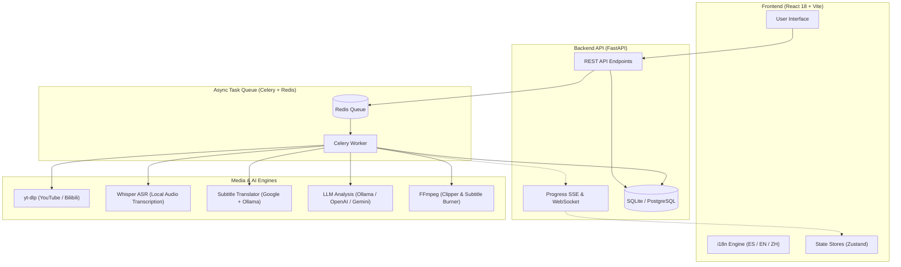

# AutoClip Multi-Language - System Architecture

AutoClip Multi-Language is a modular, event-driven, full-stack application designed for autonomous video analysis, short-form highlight extraction (45–90s), multilingual subtitle generation, and automated video clip production.

---

## 🏗️ Architecture Overview

The system consists of four primary layers:
1. **Frontend UI**: Built with React 18, Vite, Ant Design, and custom CSS for high performance and responsive layout. Fully localized via `react-i18next`.
2. **Backend API**: Powered by FastAPI, SQLAlchemy, and Pydantic, handling video ingestion, parsing, pipeline management, and SSE/WebSocket real-time updates.
3. **Asynchronous Task Queue**: Celery with Redis broker, managing heavy compute workloads (video downloading via yt-dlp, audio extraction, Whisper transcription, LLM highlight scoring, and FFmpeg video cutting).
4. **AI & Media Processing Core**:
   - **Whisper**: Local speech-to-text generating high-accuracy timecoded SRT subtitles.
   - **LLM Engine**: Provider-agnostic engine supporting offline local Ollama models (`gemma`, `qwen`), OpenAI, Google Gemini, Claude, and DeepSeek.
   - **Subtitle Translation Engine**: Multi-tier translation pipeline with automatic fallback between Google Translate API and local Ollama offline translation.
   - **FFmpeg Engine**: Media processing pipeline for lossy/lossless stream clipping, aspect ratio framing (9:16 vertical reels or 16:9 standard), and hardcoded ASS subtitle burning.



---

## 🔄 Processing Pipeline

When a video URL (YouTube/Bilibili) or local file is imported, the autonomous pipeline executes the following stages:

```
[ Ingest ] ➔ [ Subtitles ] ➔ [ Content Analysis ] ➔ [ Highlight Detection ] ➔ [ Video Export ]
```

### Stage 1: Ingestion (`INGEST`)
- Validates URL or file input.
- Downloads highest quality video stream and audio tracks using `yt-dlp` with multi-strategy fallback (user browser cookies, Firefox session detection, mobile client fallback).
- Merges audio and video into standard MP4 format.

### Stage 2: Subtitle Generation & Translation (`SUBTITLE`)
- Checks for platform subtitles (.srt / .vtt).
- If unavailable or requested, automatically runs **Whisper AI** on extracted audio to transcribe speech with word-level timestamps.
- If target output language differs from video language (e.g., English speech on a Spanish UI), the subtitle translator kicks in:
  1. Fast batch translation via Google Translate.
  2. If rate-limited or offline, automatically falls back to local **Ollama** model (`gemma4` or `qwen2.5`).

### Stage 3: Content Analysis (`ANALYZE`)
- Subtitle text is chunked into logical semantic segments.
- LLM analyzes full transcript to outline main topics, narrative arcs, and key themes.

### Stage 4: Highlight Detection & Scoring (`HIGHLIGHT`)
- LLM scores segments based on viral potential, engagement, clarity, and completeness.
- Clips are bounded between **45 and 90 seconds** (optimal length for TikTok, Reels, and Shorts).
- Generates engaging, multilingual titles for each clip.

### Stage 5: Video Export & Subtitle Burning (`EXPORT`)
- Precise video extraction using FFmpeg without audio desync (`-avoid_negative_ts make_zero`).
- Slices the translated SRT subtitles matching exact clip duration.
- Hardcodes stylized subtitles using ASS filter with **bold yellow text and solid black outline** (`FontSize=16, PrimaryColour=&H0000FFFF&, OutlineColour=&H00000000&, Outline=2.5`).
- Produces clean MP4 ready for social media publishing.
