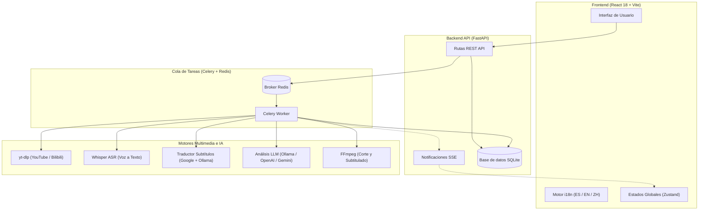

# AutoClip Multi-Language - Arquitectura del Sistema

AutoClip Multi-Language es una aplicación full-stack modular y orientada a eventos, diseñada para el análisis autónomo de videos largos, extracción de momentos destacados en formato Reels (45–90s), generación y traducción de subtítulos multilingües y renderizado automático con subtítulos quemados.

---

## 🏗️ Capas de la Arquitectura

1. **Frontend (React 18 + Vite)**:
   - Interfaz reactiva y moderna basada en Ant Design y diseño personalizado Calm Premium.
   - Soporte multilingüe completo (Español, Inglés, Chino) mediante `react-i18next` con detección automática del idioma del navegador y sincronización bidireccional.
2. **Backend API (FastAPI)**:
   - Enrutadores asíncronos para proyectos, descargas, configuración y estado en tiempo real (SSE y polling).
   - Localización dinámica de categorías y mensajes según cabecera `Accept-Language` o parámetro del proyecto.
3. **Cola de Tareas Asíncronas (Celery + Redis)**:
   - Gestiona las cargas pesadas de cómputo: descarga de video con `yt-dlp`, transcripción de audio con Whisper, análisis semántico con LLM y renderizado de video con FFmpeg.
4. **Motores de IA y Procesamiento Multimedia**:
   - **Whisper ASR**: Transcripción local de voz a texto con marcas de tiempo a nivel de palabra en archivos SRT.
   - **Motor LLM**: Agnóstico a proveedores, compatible con modelos locales vía **Ollama** (`gemma`, `qwen`), OpenAI, Google Gemini, Claude y DeepSeek.
   - **Traductor de Subtítulos**: Pipeline de traducción con respaldo automático entre Google Translate y modelos locales de Ollama.
   - **FFmpeg**: Corte de fragmentos sin desfase de audio (`-avoid_negative_ts make_zero`) y quemado de subtítulos estilizados en formato ASS.

---

## 🔄 Flujo de Procesamiento

Al importar un enlace de video o subir un archivo local:
1. **Ingesta (`INGEST`)**: Descarga del video y audio con multi-estrategia tolerante a bloqueos y combinación en formato MP4.
2. **Subtítulos (`SUBTITLE`)**: Detección de subtítulos existentes o ejecución de Whisper ASR para transcribir el audio. Si el idioma de destino es distinto al del video, se ejecuta la traducción automática por lotes.
3. **Análisis (`ANALYZE`)**: Segmentación del texto y análisis temático mediante LLM para identificar argumentos principales y estructura narrativa.
4. **Selección de Momentos (`HIGHLIGHT`)**: Puntuación de fragmentos enfocados en retención e interés, acotando su duración a **45–90 segundos** con títulos atractivos.
5. **Exportación (`EXPORT`)**: Extracción del fragmento con FFmpeg y quemado de subtítulos en **letra amarilla con contorno negro sólido**.
